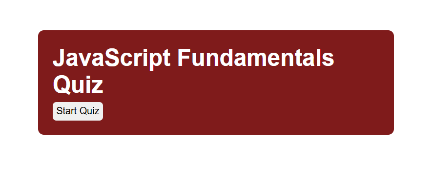
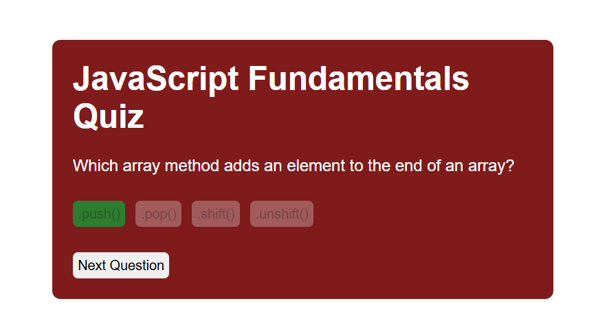
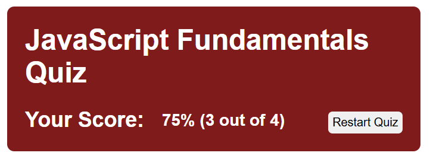

# JavaScript Quiz App

## What it is
A simple interactive quiz built using HTML, CSS, and JavaScript. Users can answer multiple choice questions, receive immediate feedback, and view their final score at the end. 

## Features
- Dynamic question rendering
- Multiple choice answer with click events
- Immeditade feedback (correct/incorrect) through button coloration
- Score tracking
- Restart functionality

## Screenshots
Home Screen:

Question View:

Score Screen:

## How to Run

1. Download or clone the repository
2. Open the project folder in VS Code
3. Open `index.html` in your browser (or Live Server)

## Technologies Used
- HTML
- CSS
- JavaScript

## Project Structure
- index.html
- style.css
- app.js

## What I Learned
- DOM manipulation with JavaScript
- Event handling with addEventListener
- Dynamic element creation
- Managing application state (score, current question)

## Future Improvements
- Add timer functionality
- Add more questions
- Improve UI/UX design
- Store high scores
- Randomize questions